**The University of Melbourne**
# COMP30019 – Graphics and Interaction

## Teamwork plan/summary

<!-- [[StartTeamworkPlan]] PLEASE LEAVE THIS LINE UNTOUCHED -->

<!-- Fill this section by Milestone 1 (see specification for details) -->
1. Player design | Ziming
2. Gadget design | Ziming
3. Procedural generator for trees | Ziming
4. Enemy AI | Yihang
5. Two Shaders | Yihang
6. particle system | Kailun
7. UI | Kailun
8. Film gameplay video | Kailun
9. Map and level design | Yaofei
10. Lighting | Yaofei
11. User querying and observation | Yaofei
12. Final report | Yaofei
<!-- [[EndTeamworkPlan]] PLEASE LEAVE THIS LINE UNTOUCHED -->

### Table of contents
* [Game Summary](#game-summary)
* [Game Instructions](#game-instructions)
* [Enemies](#enemies)
* [Collectable Gadgets](#collectable-gadgets)
* [Gameplays](#gameplays)
* [Graphics Pipeline](#graphics-pipeline)
* [Procedural Generation](#procedural-generation)
* [Particle System](#particle-system)
* [Evaluations](#evaluations)
* [References](#references)

### Game Summary

Throughout the Magicland, a legend is told. On a distant island, a rotten tree of taken stood, turning villiges into inferno, animals into bloodthirsty monsters. To end the era of calamity and bring peace to mankind. Young Kun Kun must take the adventure. 

_Kun Kun’s Bizarre Adventure_ is a 2.5D parkour platformer game. you will be role-playing Kunkun and take an advanture on a magic land. Defeat all enemies on the way, and finally challenge the ultimate boss to bring peace to this land.  

### Game Instructions
* Basic Movement

  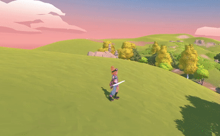

  In this 2.5D platformer game, player can use A D to move left and right, press SPACE to jump, and press SPACE twice to perform a double jump.  

* Roll forward

  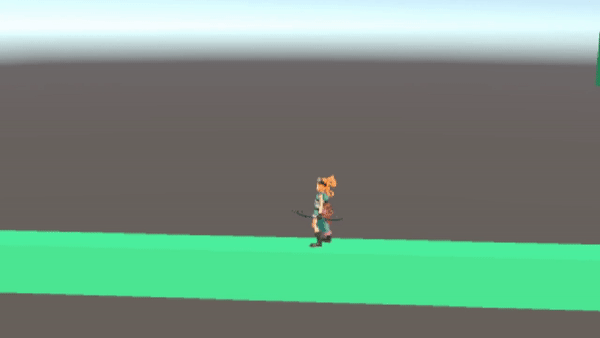

  Play can press C to roll forward.  

* Basic attack

  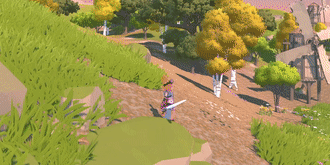

  Player is able to press left mouse button to lanuch light attack, right mouse button for heavy attack, with different attack damage assigned.

* Weapon system

  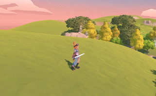

  we have two types of weapon in the game, sword and bow. Press 1 to use sword. Press 2 to switch to the bow. 

### Enemies
  We are excited to show you our interesting and varied enemies. 

<table border="1">
 <tr>
    <td><b style="font-size:30px">Enemies</b></td>
    <td><b style="font-size:30px">Description</b></td>
 </tr>
 <tr>
    <td>
      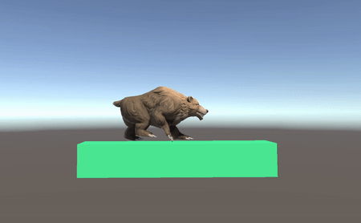
    </td>
    <td>
      Yes! it's a bear. It can move left and right within customizable moving range, and deal damage to the player when they collide  
    </td>
 </tr>

<tr>
    <td>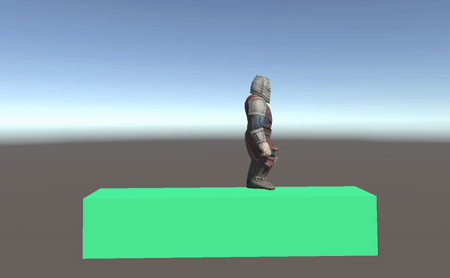</td>
    <td>Same as Bear, this enemey moves left or right in a designed area, and deals damage to the player when they collide 
    </td>
 </tr>

<tr>
    <td>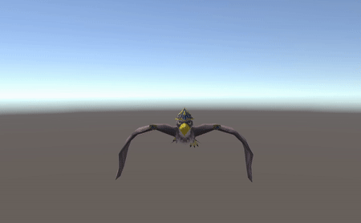</td>
    <td>Jumper Bird will move in a designed direction when a preset behavior is triggered, deal damage to the player when they collide. 
  </td>
 </tr>

<tr>
    <td>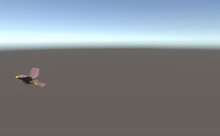</td>
    <td>Tracker Bird will track player if player is located at its sight area, deal damage to the player when they collide. 
  </td>
 </tr>

<tr>
    <td>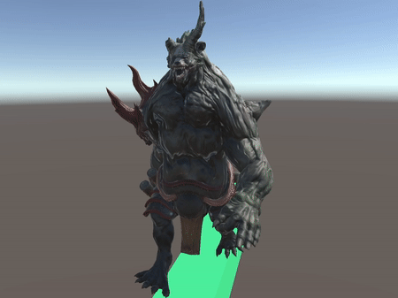</td>
    <td> This is the ultimate and hardest boss player has to defeat. It is controlled by a smart AI! It can also go into invisible mode. How thrilling it is!  
  </td>
 </tr>

</table>

### Collectable Gadgets 
<table border="1">
 <tr>
    <td><b style="font-size:30px">Effects</b></td>
    <td><b style="font-size:30px">Items</b></td>
 </tr>
 <tr>
    <td>
      This red potion can increase player's health. 
    </td>
    <td>
      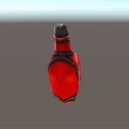
    </td>
 </tr>
 <tr>
    <td>
      Player can pick up and carry this arrow set. 
    </td>
    <td>
      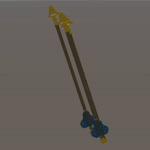
    </td>
 </tr>
 <tr>
    <td>
      This blue potion can turn player into invincible mode that will last some time. 
    </td>
    <td>
      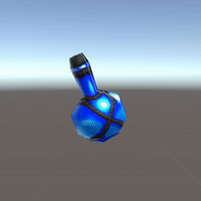
    </td>
 </tr>

</table>

### Gameplays
  To check our gameplay, open this [link](https://www.youtube.com/watch?v=BIWlkeQ0PZA).

### Graphics Pipeline
  We implemented two custom shaders to make the visual of our game more interesting while supporting important mechanics in our game.

Shaders we would like to to be marked:
 * Invisible Shader
 * Player Hurt Post-effect

#### Invisible Shader Assets/Shaders/InvisibleShader.shader
  We followed unity’s manual shader fundamentals to create our first shader, the link of this document is reference. We created this shader to apply on our boss, who has a special ability to turn itself invisible. Our first intuitive idea to achieve this skill is to delete its material or disable its mesh to make it disappear in the game, but we later found out that this makes the boss overpowered since disappearing completely does not give the player any chance of doging incoming attacks. After some discussion, we decided to use refraction to make the boss harder to distinguish from its surroundings, but still somewhat visible to the player, and this is achieved through a custom refraction vertex shader.

  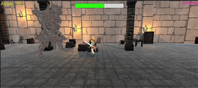  

  The vertex shader simply calculate the world position, the direction, and the normal, then pass these information plus a refraction index(0.1 for our shader because we don’t want the color to change too much so the enemy can still blend in) into the built-in refract function, which will return a refracted vector, which will then be used by the fragment shader to sample the selected material.

#### Player Hurt Post-effect Assets/Shaders/Hurt.shader

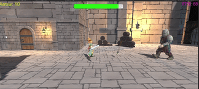  

  We created this shader because we want to give the player a clear indication of being under attack. We already have an animation of the player hurt by enemy attacks, but we decide it’s not enough since the player model blends in the environment too well. We want the screen to turn red whenever the player takes damage, but we don’t want the screen to turn completely red, because then the player won’t be able to see anything, so we can’t just slap a red material on the screen. We need to add red to the original color of each pixel, but if we do this process by using cpu the game becomes unplayable due to the laginess. To reduce the burden  of the cpu, we will need to shift this process to the graphic card by using a shader.The shader itself is very simple, take a pixel on the screen and add the rgb color of red on to that pixel.

### Procedural Generation
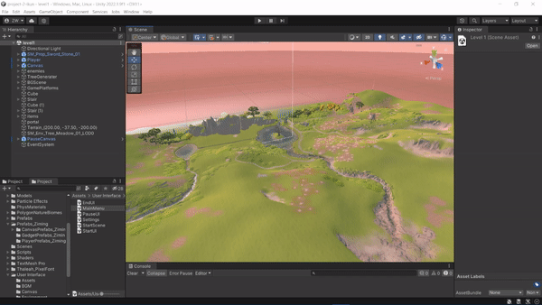

#### **Introduction**  
We implement a precedure generator for forests. A single generator can generatate a random forest in a certain area and features of this forest will vary each time. We set up 6 different generator in level 1 so that the gameplay visuals are significantly enhanced. From the observations, many participants raised positive feedback on this and they believed that it is refreshing and immersive to play in a scene with variable visuals each time.  

#### **Arguments**
Here are some arguments of the forest generator. These arguments can control the features (area, density, gap, tree types) of a forest.  
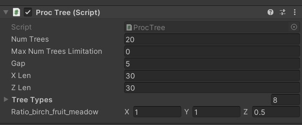
+ **X len** and **Z len** constrains the area of a forest.
+ The **Gap** enforces the minimum gap of trees.
+ The previous three arguments (**X len**, **Z len**, and **Gap**) together determine the maximum number of trees that can be generated in a certain place, and this limitaion will be reflected on the argument **Max Num Trees Limitation**. **Max Num Trees Limitation** will be calculated at run time and provide us with the useful information. It doesn't make any sense to modify this.
+ Knowing the maximum available trees, we can set up **Num Trees**, which determines how many trees should be placed in this area. Of course this value shouldn't be larger than **Max Num Trees Limitation**.
+ **Tree Types** is simply an array that cotains all the tree prefabs we wish to place. In level 1, we use 8 differents types of trees. There are birch trees, fruit trees, and meadow trees.
+ We also design the argument **Ratio_birch_fruit_meadow** to control the ratio of tree types. This ratio can be set up in any scale, as we will normalize it in run time. For example, in order to make a forest with more birch trees, the ratio can be set up as 2-1-1. Note that this is more like the probability ratio than the strict quantity ratio. Please refer to algorithm section below for more details. 
  
Here is a demo of different ratio in a certain area.   
+ Ratio:1-1-1(balanced)  
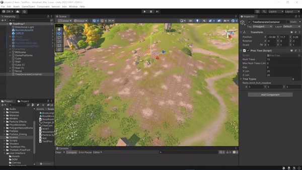  
+ Ratio:1-1-0(No Meadow tree)  
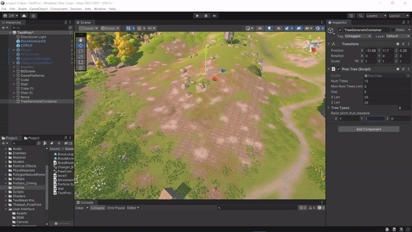

#### **Algorithms**
Once the arguments are set up, the generator will start to determine the tree positions. Firstly, it will calculate all the possible available placement points, based on **X Len**, **Z Len**, and **Gap**, by "griding" a area. A grid's length and width are **Gap**. The vertices of grids are the available candidate placement points. Then, based on **Num Trees**, the generator will pick up this number of points randomly as actual placement point. After that, generator will start to assign each point with a tree. The generator will set up a pool that contains all the available tree types. Each tree type's quantity in this pool is determined by their ratio*20. For example, for a ratio 2-1-1. There would be (2/(1+1+2))*20 birth trees in pool. Finally, for each placement point, the generator will assign a tree by picking a type randomly from this pool.  

Another interesting take is how we place the trees with their bottom located on the ground. Since our terrian is rugged, we can't simply hard code the height. Therefore, for each placement point, we determine the Y by shooting a ray from above and calculating the hit point with the terrian. Then align the bottom of a tree to this point. As for the ray's start Y height, it is the same as this generator object's Y height. Therefore, when we place a generator object in the scene, we need to make sure its height is higher than the highest terrian in the area. 

### Particle System

#### Arrow Trailing Assets/Particle Effects/Trailing Effect/ArrowTrailing.prefeb

#### **Introduction**  
To introduce more graphical variety to our project, two particle systems are implemented, each enhances the animation of our main character's sword and bow.
When the team is designing the particle systems, we aim to create effects which could be add-ons to our existing visual elements rather than distractions. As a result, both particle systems implemented use "Rate Over Distance" rather than "Rate Over Time" for passive emissions. The Bow Trailing effect will be the one that is focused on in this section.

#### **Arguments**
Main arguments of the fire bow Trailing effect are attached below:

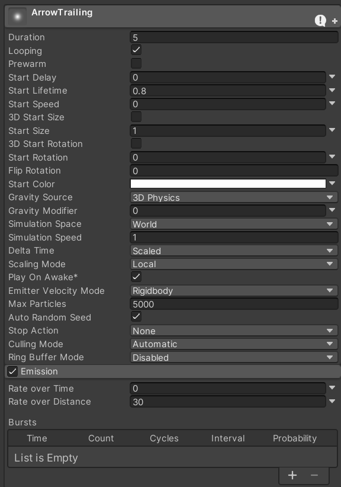
  

  
* We aim to recreate a fire-like effect for the arrow which traces its path/trajectory. Such effect should be achieved by casting large amount of small sized particle.
* By setting Max Particles to 5000, it enables enough number of particles to coexist on screen to form visible tracing effect.
* After numbers of testings, our team has decided to set the Gravity Modifier to 0, since both a positive and negative number could cause particles to distribute unevenly on each side of the arrow.
* The passive emission of particles could be achieved by disabling Rate over Time emission and enabling Rate over Distance, resulting in motion triggered effect.
* The emission rate over distance is set to 30, avoiding overpopulating the number of particles which could leads to distractions during gameplay.

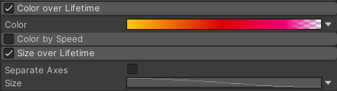
  

  
* Colour over Lifetime is used to recreate the colour change of fire sparkles.
* By adding a tint of pink after red colour's appearance could result in more vivid colour change effect.
* To mimic the effects of fire sparkles vanishing in wind, the final state of Colour over Lifetime is set to have 0 opacity.
* Size over Lifetime could also contribute to recreating vanishing sparkle effect by gradually decreasing the particle size as it moves.
  

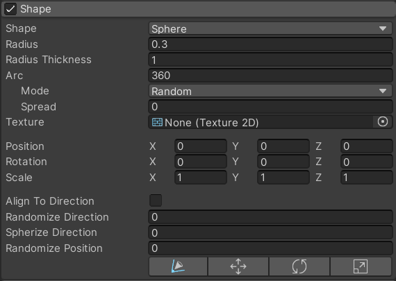
  

  
* A sphere-shaped area of emission is used in our design with an emission arc of 360 degrees. Such design is suitable to mimic the behaviour of fire on flying arrows, since if a cone shape emission area is used, the particles would visually appear like an afterburner on a missel rather than fire.
  

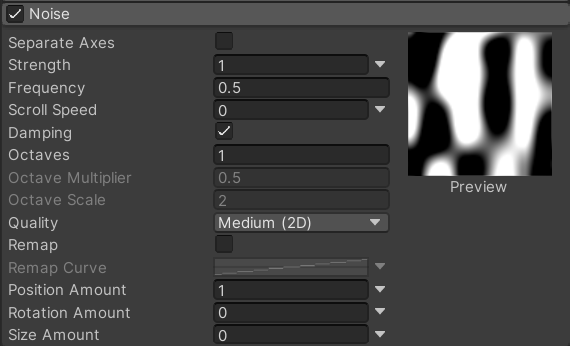
  

  
* Noise is introduced to recreate the effect of turbulent wind on the arrows flying trajectory.
* After numbers of trying and testing, the team has discovered that by setting the Noise Frequency to 0.5 could always produce that most satisfactory visual result.
 

 
#### **Demonstrations**
Live examples of the fire bow Trailing effect are attached below:

* Bow Trailing effect in-game

  

* Fire Particles on its own

  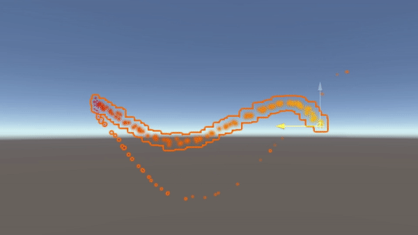

### Evaluations
  The most important step in developing our games is to test them with actual players. This process allows us to identify and solve problems that we as developers have overlooked.
  
  Therefore, we invited 10 participants to test our game using the observational method. We also applied the querying method on 5 of them to gather data and further refine and polish our game.

#### Observational Methods
  For the observational methods, we applied `Post-task Walkthrough`. By the end of each development period, we held a meeting with participants to observe and record their live gameplay on some tasks we designed. The participants' reactions and thoughts were curcial to us as they reflected the playablity of our game. They could also help us spot bugs. 

  We asked participants to perform following tasks:
  * Move the character
  * Change weapon
  * Shoot an arrow
  * Get hit by bear
  * Pass the bridge
  * Enter the portal
  * Defeat the boss
  * Find hidden path
  * Go through the whole game

  After they finished, we played the recording back to them and collected their impressions and thoughts. 

  Here were some reflections we collected:  
  The majority of participants commented that the fps in the first level was uncomfortable, which was under 60 fps. Our diverse, dynamic environments prevented most laptop participants from experiencing high fps gameplay. This was due to our mis-estimation of the player's computer graphic performance. So we added Level of Detail (LOD) on meshes, to reduce the number of GPU operations that Unity requires when render distant meshes. We also reduced the number of auto-generated trees to increase fps. 

  Some participants noticed that the character would stay in the falling animation after landing. This issue did not affect the gameplay, but from a design aesthetic point of view, we immediately looked into this and found the problem. The 'playerBottomTransform', which determined whether the character had landed, couldn't detect the undulating ground well. Therefore, we lowered its height and modified the code to make it fit the ground better.

  Some players requested a pause button as well as the ability to change volume settings in game from the pause menu. So we added a pause menu with volume control options. Moreover, we also added the bow and arrow due to the participants' request on varied weapon system. And with particle effects. New props had been added to make it easier for players to get through the levels. Ambient lighting had been added to allow players to see clearly.

  Some players reported that the game was too hard. Therefore, we added serveral gadgets such as "health potion" and "invincible potion" to reduce the difficulty. 

  We adapted most of the requests, while some requests such as "I want more levels" and "I want more weapons" were not fulfilled due to our limited development time.
  
  After applying the changes, We let them replay the games. Most of them were very happy with the brand new version. 

#### Querying Method
  In order to involve as many participants as possible in the session, we chose `Questionnaires`. Interviews were too time consuming for us and it was easier for us to collect feedback from questionnaires. 

  For the questionnaires, we appled SUS (System Usability Scale) with reference of [SUS - A quick and dirty usability scale ](https://digital.ahrq.gov/sites/default/files/docs/survey/systemusabilityscale%2528sus%2529_comp%255B1%255D.pdf), and thus made these 10 questionnaires with scale of 1 to 5. Here were the test results of 5 participants doing the questionnaires:

  |questionnaires  |Average response   |   
  |---   |---  |    
  |I enjoy the game.  |  4.67   |       
  |I find the game unnecessarily complex   |    	4.30 |        
  |I think the game is easy to play   |  	4.30   |        
  |I think that I need the support of someone to pass the game  |  4   |        
  |I know how to control the game.  |  4.67   |        
  |I find the game mechanics diverse enough.  |   4.67  |        
  |I think the aesthetics of the game is not outstanding.  | 3    |        
  |I believe that most people can not pass the game  |  4   |        
  |I find the hidden path  |  1   |        
  |I think there are too many bugs in this game   |   3  |            
  

### changes taken

  * added Level of Detail (LOD) for meshes

  * reduced procedural generation trees amount

  * fixed player jumping issue

  * added pause and volume change menu

  * added new weapon with particle effects 

  * added health potion and invincible potion

  * added potions with diffrent effects

## References
  We have used the following resources to help us with the development of the game.
  1. [Enviroment artistic asset from Unity Asset Store](https://assetstore.unity.com/packages/3d/environments/fantasy/polygon-meadow-forest-nature-biomes-low-poly-3d-art-by-synty-234255).
  2. [Dungeon artistic asset from Unity Asset Store](https://assetstore.unity.com/packages/3d/environments/stylized-hand-painted-dungeon-free-173934).
  3. [Player artistic assets from Unity Asset Store](https://assetstore.unity.com/packages/3d/characters/humanoids/picochan-220038).
  4. [Custom shader fundamentals from Unity Manual](https://docs.unity3d.com/Manual/SL-VertexFragmentShaderExamples.html).
  5. [FREE Stylized Bear - RPG Forest Animal from Unity Asset Store](https://assetstore.unity.com/packages/3d/characters/animals/free-stylized-bear-rpg-forest-animal-228910).
  6. [Egypt Pack - Eagle from Unity Asset Store](https://assetstore.unity.com/packages/3d/characters/animals/birds/egypt-pack-eagle-140079).
  7. [Battle Wizard Poly Art from Unity Asset Store](https://assetstore.unity.com/packages/3d/characters/humanoids/fantasy/battle-wizard-poly-art-128097).
  8. [Various Charater Animations and Models From Mixamo Adobe](www.mixamo.com).
  9. [Potion, Coin, and Box of Pandora Pack](https://assetstore.unity.com/packages/3d/props/potions-coin-and-box-of-pandora-pack-71778). 
  10. [Basic Motion Animation Pack](https://assetstore.unity.com/packages/3d/animations/basic-motions-free-154271). 
  11. [Elven Long Bow and Arrow Pack](https://assetstore.unity.com/packages/3d/props/weapons/elven-long-bow-17728). 
  12. [Seven Sword Pack](https://assetstore.unity.com/packages/3d/props/weapons/seven-swords-seven-stylized-swords-14304). 
  13. [RPG BGM-Dungeon](https://assetstore.unity.com/packages/audio/music/rpg-bgm-dungeon-37116). 
  14. [Sword Sound Attack](https://assetstore.unity.com/packages/audio/sound-fx/weapons/swordsoundpack-177824). 
  15. [RPG Character Mecanim Animation](https://assetstore.unity.com/packages/3d/animations/rpg-character-mecanim-animation-pack-free-65284). 
  16. [Warrior Bundle](https://assetstore.unity.com/packages/3d/animations/warrior-pack-bundle-2-free-42454). 
  17. [Back Motion Free Pack](https://assetstore.unity.com/packages/3d/animations/basic-motions-free-pack-25900). 
